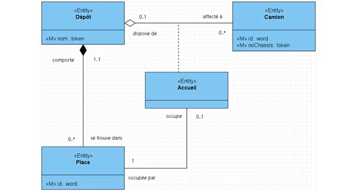

<a href="../README.md">
  
</a>

# DOCUMENTATION EPHEMERE


# Sommaire

- [Navigation](#navigation)


---

# Découverte de MERISE

- [x] Comprendre l'historique et le contexte
      [Comprendre l'historique et le contexte](#comprendre-l-historique-et-le-contexte)
- [x] Identifier les différents niveaux de MERISE
      [Les différents niveaux de Merise sont](#les-différents-niveaux-de-merise-sont)
- [x] Comprendre le vocabulaire de base
      [Les différents niveaux ](#les-différents-niveaux-de-merise-sont)

- [x] Les concepts de base du MCD

  - [x] Les entités

    - [x] Savoir définir les entités
          [Définir une entité](#définir-une-entité)

    - [x] Savoir nommer les entités
          [Savoir nommer les entités](#nommer-les-entités)
    - [x] Savoir identifier les occurrences
          [Savoir identifier les occurrences](#identifier-les-occurrences-d-entités)
          [Tableau_représentatif](#tableau-représentatif)

  - [x] Le dictionnaire de données
        [Le dictionnaire de données](#le-dictionnaire-de-données)

    - [x] Savoir créer un dictionnaire de données
          [Savoir créer un dictionnaire de données](#savoir-créer-un-dictionnaire-de-données)
    - [x] Savoir définir les propriétés
          [Savoir définir les propriétés](#savoir-définir-les-propriétés)
    - [x] Savoir typer les propriétés
    - [x] Savoir documenter les propriétés

  - [x] Les associations
        [Les associations](#les-associations)
    - [x] Savoir définir les associations
    - [x] Savoir nommer les associations
    - [x] Savoir identifier les cardinalités

- [x] Les règles de gestion
      [Les règles de gestion](#les-règles-de-gestion)

  - [x] Savoir extraire les règles d'un cahier des charges
  - [x] Savoir formaliser les règles de gestion
  - [x] Savoir valider la cohérence des règles

- [ ] Installation de Looping
      [Installation de Looping sur ubuntu](#installation-de-looping)

---


### Comprendre l historique et le contexte


**La méthode Merise est une méthode d'analyse et de conception des systèmes d'information née en France dans les années 1970**.

Merise, développée en France dans les années 1970 avec le soutien du ministère de l'Industrie, est une méthode rigoureuse de modélisation des données et traitements, visant à refléter fidèlement les processus métiers.

#### Origine

Merise, développée en France dans les années 1970 avec le soutien du ministère de l'Industrie, est une méthode rigoureuse de modélisation des données et traitements, visant à refléter fidèlement les processus métiers.

#### Contexte et Motivations

Dans les années 1970, face à la complexité croissante des systèmes, à l'hétérogénéité des méthodes, et au besoin de structuration des données, Merise apporte une modélisation en niveaux conceptuel, logique et physique.

#### Structure de la Méthode Merise

Merise s’appuie sur deux modèles : le Modèle de Données (MCD) pour structurer l'information, et le Modèle de Traitements (MCT) pour les flux. Elle suit une approche cyclique en quatre étapes : étude, réalisation, maintenance.

---

### Les différents niveaux de Merise sont

#### Niveau conceptuel :

représente les données et traitements de façon indépendante de toute implémentation technique, centré sur la réalité métier.

#### Niveau logique :

précise la structure des données et des traitements, adaptée aux contraintes d'un SGBD (système de gestion de base de données) spécifique, sans être lié à une plateforme technique.

#### Niveau physique :

détaille la mise en œuvre technique des données et traitements sur une infrastructure informatique précise (par exemple, le choix du SGBD, des index, etc.).

<a href="#sommaire">

</a>

---


# LES CONCEPTS DE BASE DU MCD


## Définir une entité


## Réponse simple :

- Une entité est un élément fondamental du modèle, comme un objet ou une personne, qui représente un concept important.

- si le francais est utilisé on doit tout faire en francais et la même chose pour l'anglais

- tout devrai etre au pluriel ; pour ne pas confondre avec les **diagrammes de classe** qui sont au singulier

#### Cas pratique Pokémon :

Dans une base de données Pokémon, les entités pourraient inclure POKEMON, DRESSEUR, et TYPE.


## Nommer les entités


Réponse simple :
Les entités doivent être nommées de manière claire et singulière pour être compréhensibles. Utilisez des noms au singulier et en majuscules pour une meilleure lisibilité.

#### Cas pratique Pokémon :

POKEMON pour représenter un Pokémon unique, DRESSEUR pour chaque personne qui les entraîne, et TYPE pour des catégories comme Eau, Feu, ou Plante.


## Identifier les occurrences d entités


Réponse simple :
Chaque occurrence est une instance spécifique de l’entité. Il est essentiel d’associer une clé unique à chaque occurrence.

#### Cas pratique Pokémon :
Chaque Pokémon (ex. "Pikachu") est une occurrence de l’entité POKEMON. Dans une table POKEMON, chaque Pokémon a un identifiant unique (comme id_pokemon) pour le distinguer des autres.

<a href="#sommaire">

</a>


# Tableau représentatif




---


# Le dictionnaire de données

| Nom de la propriété | Type           | Description                            | Exemple                  |
| ------------------- | -------------- | -------------------------------------- | ------------------------ |
| `ID`                | `Entier`       | Identifiant unique pour chaque Pokémon | `1`                      |
| `Nom`               | `Texte`        | Nom du Pokémon                         | `Pikachu`                |
| `Type_Principal`    | `Enum(Texte)`  | Type principal du Pokémon              | `Électrique`             |
| `Type_Secondaire`   | `Enum(Texte)`  | Type secondaire (ou `null`)            | `null`                   |
| `Niveau`            | `Entier`       | Niveau du Pokémon                      | `42`                     |
| `Points_de_Vie`     | `Entier`       | Points de vie maximum du Pokémon       | `120`                    |
| `Attaques`          | `Liste(Texte)` | Liste des attaques connues             | `["Tonnerre", "Éclair"]` |
| `Évolution`         | `Texte/Null`   | Prochaine évolution (ou `null`)        | `Raichu`                 |
| `Date_de_Création`  | `Date`         | Date d’ajout dans la base              | `2024-11-12`             |

## Savoir créer un dictionnaire de données

Pour créer un dictionnaire de données, commencez par lister toutes les propriétés importantes à inclure dans la base (ex. : ID, Nom, Type_Principal).
Organisez-les dans un tableau avec les colonnes :
Nom de la propriété, Type, Description, et Exemple.
Cela aide à visualiser et structurer les informations.

```
Dans un dictionnaire de données pour les Pokémon,
on pourrait inclure les propriétés suivantes pour chaque Pokémon :
 ID, Nom, Type_Principal, Type_Secondaire, Niveau, Points_de_Vie, Attaques, Évolution, Date_de_Création.
 Chaque propriété détaille un aspect spécifique de chaque Pokémon.
 Par exemple, un enregistrement pour Pikachu inclurait : ID 25, Nom Pikachu, Type_Principal Électrique.
```

## Savoir définir les propriétés

Chaque propriété doit décrire un aspect unique et pertinent de l’entité. Par exemple, pour un Pokémon : Nom pour son nom, Type_Principal pour son type élémentaire, et Niveau pour son niveau actuel. Chaque propriété doit avoir un rôle précis et identifiable.

- ID : Identifiant unique pour chaque Pokémon (par exemple, 25 pour Pikachu).
  Nom : Le nom du Pokémon, ex. : Pikachu.
  Type_Principal : Le type principal de Pikachu serait Électrique.
  Type_Secondaire : Certains Pokémon ont un type secondaire, comme Bulbizarre qui est de type Plante/Poison.
  Niveau : Le niveau du Pokémon, par exemple 42 pour un Pikachu bien entraîné.
  Points_de_Vie : La quantité de points de vie du Pokémon, par exemple 120 pour un Pikachu en bonne santé.
  Attaques : Les attaques que le Pokémon connaît, comme ["Tonnerre", "Queue de Fer"] pour Pikachu.
  Évolution : Pokémon vers lequel il peut évoluer, ici Raichu pour Pikachu.
  Date_de_Création : Date à laquelle le Pokémon a été ajouté dans la base de données, comme 2024-11-12.

## Savoir typer les propriétés

Choisissez un type qui correspond aux données de chaque propriété. Exemples : Entier pour les nombres comme Niveau, Texte pour les mots comme Nom, Enum(Texte) pour des choix limités comme Type_Principal, Date pour une date précise comme Date_de_Création.

- ID : Entier – Pour garantir un identifiant numérique unique, comme 25 pour Pikachu.
  Nom : Texte – Contient le nom du Pokémon, tel que Pikachu.
  Type_Principal et Type_Secondaire : Enum(Texte) – Limité à des valeurs spécifiques, comme Électrique pour Pikachu.
  Niveau : Entier – Contient un nombre indiquant le niveau du Pokémon, comme 42.
  Points_de_Vie : Entier – Pour représenter la santé, par exemple 120 pour Pikachu.
  Attaques : Liste(Texte) – Collection des noms d’attaques, comme ["Tonnerre", "Queue de Fer"].
  Évolution : Texte/Null – Soit le nom du Pokémon en évolution (Raichu pour Pikachu) ou null pour les Pokémon sans évolution.
  Date_de_Création : Date – Indique la date d’ajout, ex. 2024-11-12.

## Savoir documenter les propriétés

Chaque propriété doit être documentée avec une description claire et concise, expliquant son utilité et son format attendu. Par exemple : ID - Identifiant unique, Entier - pour garantir l'unicité; Attaques - Liste des capacités, Liste(Texte) - pour répertorier les attaques connues.

- ID : Type : Entier – Identifiant unique pour chaque Pokémon. Par exemple, 25 pour Pikachu.
  Nom : Type : Texte – Nom du Pokémon. Ex. : Pikachu.
  Type_Principal : Type : Enum(Texte) – Type principal élémentaire (ex. Électrique pour Pikachu).
  Type_Secondaire : Type : Enum(Texte) ou null – Type secondaire s'il existe (ex. Poison pour Bulbizarre ou null pour Pikachu).
  Niveau : Type : Entier – Niveau d'expérience du Pokémon, ex. 42.
  Points_de_Vie : Type : Entier – Points de vie maximum, ex. 120.
  Attaques : Type : Liste(Texte) – Liste des attaques connues par le Pokémon, ex. ["Tonnerre", "Queue de Fer"] pour Pikachu.
  Évolution : Type : Texte/Null – Nom du Pokémon évolué ou null si aucune évolution, ex. Raichu pour Pikachu.
  Date_de_Création : Type : Date – Date d’ajout du Pokémon dans la base, ex. 2024-11-12.

  ***

  ***

  <a href="#sommaire">
  
  </a>


# Les associations


En MERISE, une association relie deux ou plusieurs entités pour montrer les interactions ou relations entre elles. Elle sert à structurer et organiser les données en identifiant les connexions essentielles entre les éléments d'un système.

### Savoir définir les associations
Une association se définit en analysant les interactions logiques entre deux entités. Par exemple, une association entre les entités Dresseur et Pokémon peut représenter le fait qu’un dresseur possède plusieurs Pokémon. Il est important de définir l'association par son contexte et sa fonction dans le modèle.

### Savoir nommer les associations

Le nom d'une association doit être explicite et décrire le lien entre les entités. Par exemple, pour une association entre Dresseur et Pokémon, on pourrait nommer l'association Possède ou Capturer si cela reflète mieux l’action. Les noms doivent être en rapport direct avec l'interaction pour éviter les ambiguïtés.

### Savoir identifier les cardinalités

La cardinalité exprime le nombre minimum et maximum de fois qu'une entité peut participer à une association. Par exemple, dans une association Dresseur et Pokémon, la cardinalité pourrait être 1,n du côté Dresseur (un dresseur a au moins un Pokémon) et 0,n du côté Pokémon (un Pokémon peut être capturé par plusieurs dresseurs si échangé).

---

<a href="#sommaire">

</a>


## Les Règles de gestion


### Introduction

Les règles de gestion représentent les contraintes, règles et conditions qui encadrent le fonctionnement d’un système. Elles définissent comment les données et les processus doivent être gérés en fonction des besoins spécifiques de l’entreprise ou du projet.

Les règles de gestion dans un système Pokémon peuvent inclure des contraintes sur le nombre de Pokémon qu’un dresseur peut posséder, les types d’attaques autorisés pour chaque Pokémon, ou les conditions d’évolution. Elles structurent le système pour refléter les règles du monde Pokémon.

### Savoir extraire les règles d'un cahier des charges

Pour extraire les règles de gestion, analysez attentivement le cahier des charges pour repérer les consignes précises, contraintes et attentes qui régissent les interactions et traitements. Par exemple, si le cahier des charges stipule qu’un dresseur ne peut posséder que six Pokémon, cela devient une règle de gestion.

À partir d'un cahier des charges, on pourrait extraire des règles comme :

"Un dresseur peut posséder un maximum de 6 Pokémon actifs en même temps."
"Un Pokémon ne peut évoluer que s’il atteint un niveau spécifique."
"Chaque Pokémon peut connaître un maximum de 4 attaques." Ces règles décrivent les conditions de gestion des Pokémon et des dresseurs.

### Savoir formaliser les règles de gestion

La formalisation consiste à transformer les règles en déclarations claires et précises. Elles sont souvent rédigées sous forme de phrases simples. Par exemple : "Un dresseur peut posséder un maximum de six Pokémon actifs." Cette étape permet de clarifier les règles pour les équipes de développement.

La formalisation consiste à transformer les règles en déclarations claires et précises. Elles sont souvent rédigées sous forme de phrases simples. Par exemple : "Un dresseur peut posséder un maximum de six Pokémon actifs." Cette étape permet de clarifier les règles pour les équipes de développement.

### Savoir valider la cohérence des règles

La validation des règles de gestion consiste à vérifier que les règles ne se contredisent pas et qu’elles sont applicables dans le contexte du système. Par exemple, si une règle indique qu’un Pokémon peut appartenir à plusieurs dresseurs, elle ne doit pas contredire une autre règle stipulant que chaque Pokémon est unique à un dresseur. La cohérence est vérifiée en analysant toutes les règles ensemble pour s’assurer qu’elles forment un ensemble logique et sans conflit.

La validation des règles de gestion consiste à vérifier que les règles ne se contredisent pas et qu’elles sont applicables dans le contexte du système. Par exemple, si une règle indique qu’un Pokémon peut appartenir à plusieurs dresseurs, elle ne doit pas contredire une autre règle stipulant que chaque Pokémon est unique à un dresseur. La cohérence est vérifiée en analysant toutes les règles ensemble pour s’assurer qu’elles forment un ensemble logique et sans conflit.


# Installation de looping


## Vérifier le contenu du fichier .zip

- Premièrement nous allons télécharger la version windows et double-cliquer pour créer à partir du zip un dossier installer **Looping**

## Installer Wine sur Ubuntu

- Wine est un programme qui permet d'exécuter des applications Windows sur des systèmes Linux.

- Ouvrez un terminal en appuyant sur Ctrl + Alt + T.
- Mettez à jour vos paquets en exécutant la commande suivante :

```
sudo apt update
```

- Puis nous allons installer Wine avec la commande suivante :

```
sudo apt install wine
```

---


<a href="#sommaire">

</a><a href="../README.md">

</a>

---


